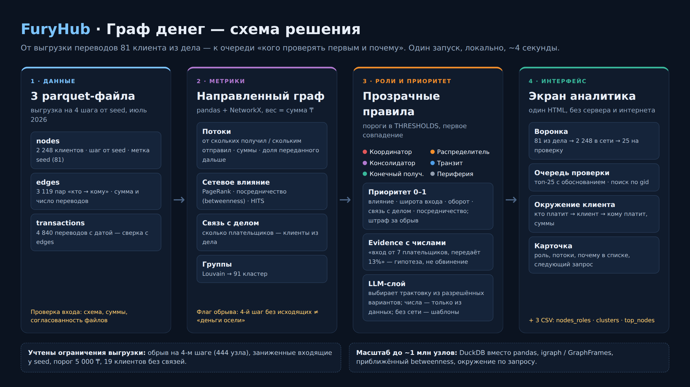

# FuryHub — «Граф денег»

## 1. Что это и какую задачу решает

Решение для кейса Freedom на HackAlem AI помогает AML-аналитику выбрать, с каких участников сети переводов начать проверку. По направленному графу оно назначает узлам 6 объяснимых ролей, объединяет их в сообщества и формирует топ-25 с числовыми основаниями для проверки. Интерактивная схема позволяет найти клиента по `gid`, изучить его окружение и проверить гипотезу о движении средств, учитывая неполноту выгрузки.

### Схема решения



## 2. Быстрый старт

### Рабочее место в браузере

В окружении Python 3.12 из корня репозитория:

```bash
python -m pip install -r requirements.txt -c constraints.txt
python app.py
```

Откройте **http://127.0.0.1:8765**. В Windows без активации окружения: `.\.venv\Scripts\python.exe app.py`.

1. Нажмите «Импортировать» и выберите CSV или Parquet с отдельными переводами. Шаблон CSV скачивается на экране; «Открыть демо» анализирует исходный набор из `data/`.
2. Проверьте предпросмотр и сопоставьте отправителя (`src`), получателя (`dst`), сумму (`sum_kzt`) и дату (`date`). Названия исходных колонок могут отличаться. Валюта и ID операции сопоставляются при наличии.
3. Задайте название и источник. Полнота исходящих по умолчанию неизвестна. Отметка о полноте — заявление аналитика о выгрузке, приложение само его не проверяет. Исходные клиенты (seed) необязательны.
4. Запустите анализ. В истории появится отдельный результат с графом и тремя обязательными CSV. Выбор узла на схеме связывается с разделом «Работа по узлам».
5. Сохраните статус проверки и заметку. Предыдущие значения остаются в истории изменений; перезапуск приложения сохраняет наборы, результаты и заметки.

CSV: UTF-8/BOM, разделитель — запятая, точка с запятой или табуляция. Даты — `YYYY-MM-DD` или `ДД.ММ.ГГГГ`, допускается время. Суммы положительные, не более двух знаков после запятой. Все переводы должны быть в **KZT**: конвертации валют нет. Ошибки показываются с исходной строкой и колонкой; некорректный набор не запускается. Повторяющиеся ID операций отклоняются. Без ID одинаковые платежи сохраняются: приложение не может считать их дублями только по дате и сумме. Повторный импорт одинакового файла с теми же настройками использует уже сохранённый набор.

Идентификаторы сохраняются строками, включая ведущие нули и длинные номера; float-идентификаторы Parquet отклоняются. При открытии выгрузок в Excel импортируйте колонку `gid` как текст. В загруженных файлах глубина обхода неизвестна: технический `depth=0` не выдаётся за известный шаг. При неизвестной полноте исходящих правила «консолидатор» и «конечный получатель» отключены. Внесение seed вручную не означает усечённых входящих; исходный хакатонный набор сохраняет собственные ограничения сбора.

Локальные ограничения: **32 МиБ на файл, 100 000 переводов, 10 000 узлов**, до 256 колонок и 256 МиБ несжатых блоков Parquet. Очередь выполняет один расчёт одновременно; процесс останавливается при превышении 5 минут. Это ограничения загрузки, а не гарантия скорости для любого графа. Прогресс показывает этап, а не точную оценку оставшегося времени. Прерванный остановкой приложения расчёт помечается как ошибка при следующем запуске.

Рабочие данные находятся в `.workspace/` (исключена из Git): SQLite, исходные загрузки, нормализованные наборы и отдельные каталоги запусков. `parameters.json` фиксирует пороги, веса и версию кода; `manifest.json` содержит параметры, версии библиотек и сведения о данных. Старые результаты не перезаписываются. Для резервного копирования остановите приложение и скопируйте **всю `.workspace/`**. Можно выбрать другой каталог: `python app.py --workspace <каталог> --port 8765`.

Сервер слушает только `127.0.0.1`; расчёты и подсказки всегда офлайн, ключ из `.env` не читается. Для локальных запросов проверяются Host, Origin и токен сессии. Это рабочее место одного аналитика. В нём пока нет общей базы пользователей, разграничения прав, SSO, командного согласования, автоматических коннекторов к банку, регламентов хранения и защищённого от администратора журнала. Заметки имеют историю, но не электронную подпись. Ввод отдельных транзакций через форму и XLSX пока не реализованы. Для внедрения в финансовую организацию потребуется отдельный этап интеграции и эксплуатации.

### Пакетный запуск без рабочего места

Распакуйте `data/` в корень репозитория; внутри должны лежать `nodes.parquet`, `edges.parquet` и `transactions.parquet`. Каталог `starter/` уже входит в репозиторий и нужен для запуска.

Из корня репозитория, в окружении Python 3.12:

```bash
python -m pip install -r requirements.txt -c constraints.txt
python run.py --data data --out out --offline
python viz.py --offline
```

Откройте `out/graph.html` в браузере. После установки зависимостей расчёт и HTML работают локально без интернета, API-ключа, GPU и сервера.

`--offline` принудительно отключает API и чтение `.env`, сохраняя локальные подсказки и доступ к валидному кешу. Без этого флага при наличии ключа используется OpenAI. В `constraints.txt` зафиксированы проверенные версии основных зависимостей; `starter/` не изменён.

Для отдельного окружения Windows: `python -m venv .venv`, затем `.\.venv\Scripts\Activate.ps1`. Все команды ниже выполняются из активированного окружения.

### Проверки

```bash
python -B -m unittest discover -s tests -v
node tests/test_viz_client.cjs
```

Нужен Node.js 22 для клиентских тестов. Интеграционные проверки запускают свежий офлайн-пайплайн и генератор HTML во временных каталогах. Они не перезаписывают `out/`. Клиентский тест проверяет логику и данные графа; реальную отрисовку нужно проверить в браузере. GitHub Actions запускает эти проверки при push и pull request.

### LLM-гипотезы и карточка узла

Для OpenAI скопируйте `.env.example` в .env и заполните `OPENAI_API_KEY`.
Модель по умолчанию — `gpt-4o-mini`; её можно изменить через `OPENAI_MODEL`.
Переменные окружения имеют приоритет над .env в корне проекта.
Без ключа, SDK или доступа к API автоматически используются локальные шаблоны.

При запуске run.py агрегаты кластеров и метрики их топ-узлов передаются в OpenAI.
Модель выбирает назначение группы и следующий запрос из разрешённых вариантов;
числа, gid и роли подставляются только из исходных агрегатов. Гипотеза всегда
содержит два предложения. Роли и приоритеты по-прежнему задаются правилами.
Карточка узла использует готовые nodes_roles.csv и edges.parquet:

```python
from llm_layer import explain_node

# gid возьмите из nodes_roles.csv; длинные идентификаторы лучше передавать строкой.
print(explain_node(gid, data_dir="data", out_dir="out"))
```

Либо: `python llm_layer.py <gid> --data data --out out --offline`. В Python доступен аргумент `offline=True`.
Карточка показывает роль, вход/выход, крупнейших контрагентов с суммами,
ограничения выборки, направление проверки и следующий запрос.

Используется Responses API с [Structured Outputs](https://developers.openai.com/api/docs/guides/structured-outputs):
JSON Schema, `strict=true`, обязательные поля и enum; полученный ответ дополнительно
проверяется локально. Свободные утверждения модели не принимаются.
Таймаут запроса — 30 секунд, автоматические повторы отключены, пакет содержит
до 25 кластеров, общий бюджет LLM-сеанса — 120 секунд. После первого сбоя,
отказа или некорректного ответа остальные результаты формируются локально.

Результаты сохраняются в `out/llm_cache.json` (при --out — в выбранном каталоге).
Ключ кеша включает модель, версию, инструкции и данные, включая метрики топ-узлов.
Повторный запуск с теми же данными использует валидный LLM-кеш даже без ключа;
изменённые данные пересчитываются. Фолбэк помечается отдельно и не блокирует
обращение к API в следующем запуске после восстановления доступа.
Повреждённый кеш пропускается; ошибка записи кеша не прерывает отчёт.
Запись кеша защищена межпроцессной блокировкой: сохраняются только изменённые записи, валидный LLM-ответ не заменяется шаблоном старого сеанса. Ожидание блокировки ограничено 2 секундами. Файл `llm_cache.json.lock` остаётся на диске; блокировкой управляет ОС.

Локальная гипотеза назначения кластера выбирается только при доле одной содержательной роли не менее 60% всех его узлов (`THRESHOLDS` в `llm_layer.py`). Иначе назначение требует уточнения. Это прозрачная эвристика, а не оценка качества разметки.

Кеш, lock-файл и .env не добавляются в Git.

### Экран аналитика

Светлые панели с терракотовыми акцентами и заголовками с засечками окружают тёмное поле сети. На схеме используются контрастные цвета ролей и светлые подписи. Все шрифты системные, внешние ресурсы не загружаются.

Воронка в шапке показывает путь **от известных клиентов → к сети переводов → к очереди проверки**; все три числа берутся из CSV. Слева — очередь из `top_nodes.csv` по рангу. При открытии выбран №1; клик или Enter на строке сразу меняет окружение и карточку.

В центре показан один шаг движения денег: плательщики слева, получатели справа, встречные связи сверху. Плашки содержат уникальный хвост gid и сумму; стрелки показывают направление. Видны до 12 крупнейших соседей с каждой стороны и 5 встречных, остальные перечислены числом и общей суммой под графом. В карточке доступны все контрагенты: первые 5, затем по 20 через «Показать ещё». Поиск по gid фильтрует весь список, включая ещё не раскрытые записи. Клик по плашке открывает соседа, «← Назад» возвращает предыдущий экран.

Справа — роль и сила сработавшего правила, полученные и отправленные суммы, числовое основание проверки, ограничения выгрузки, подсказка аналитику и крупнейшие контрагенты. Сила правила не является вероятностью нарушения. Светлая рамка на схеме отмечает клиентов из списка по делу; жёлтый бейдж — границу обхода.

Поиск принимает полный `gid` или его последние цифры (от 4). При нескольких совпадениях нужно уточнить хвост. Длина сокращённых подписей вычисляется из данных, чтобы каждый хвост был уникален; длинные gid в HTML остаются строками без потери точности. Кнопка «Обзор сети» открывает обзор топ-50 и их прямых соседей. Сообщества размещаются отдельно, центры узлов не накладываются. Клик выделяет входящие и исходящие связи клиента и приглушает остальные, пустое место снимает выделение; двойной клик открывает окружение. При отдалении видны только ключевые подписи, при приближении появляются остальные. В выделенном окружении на общем масштабе подписаны клиент и до 12 крупнейших соседей. Кнопки + / − меняют масштаб, «Вписать» возвращает всю схему в кадр. «← К окружению» возвращает к выбранному клиенту.

```bash
python viz.py                              # №1 в очереди, локальные/LLM-подсказки
python viz.py --gid <gid>                  # окружение конкретного клиента
python viz.py --cluster <cluster_id>       # обзор указанной группы
python viz.py --no-llm                     # экран без блока подсказок
python viz.py --offline                    # локальные подсказки, без чтения ключа и API
python viz.py --nodes out/nodes_roles.csv --edges data/edges.parquet --top out/top_nodes.csv --output out/graph.html
```

При `--cluster` начальная карточка принадлежит наиболее приоритетному узлу выбранной группы. Встречные потоки в окружении и обзоре разделены дугами.

`--gid` и `--cluster` взаимоисключающие; неизвестный gid завершает генерацию с кодом 1. HTML самодостаточен: библиотека vis-network и данные встроены, сервер и интернет для просмотра не нужны. Подсказки топа собираются одним пакетом; без ключа или сети используется локальный фолбэк, при ошибке слоя экран остаётся доступным без подсказок. Для генерации экрана бюджет обращения к API ограничен 10 секундами.

**Демо:** воронка → №1 → №3 → №5 и его плательщики → поиск gid жюри → «Обзор сети» → двойной клик → «← Назад».

Контрольная выгрузка: **2 248 узлов, 3 119 направленных рёбер, 4 840 переводов, 81 seed** за **1–31 июля 2026 года**; сумма переводов — **365 890 012,01 ₸**. Контрольный запуск `run.py` занял **1,41 с** (офлайн) на машине разработки; лимит проекта — **5 минут**, время на другой машине может отличаться.

## 3. Что на выходе

Три CSV в `out/`, кодировка UTF-8, разделитель — запятая. `gid` — идентификатор клиента, который при импорте в таблицы следует сохранять как текст. Все денежные величины — в тенге и только по видимой части сети.

### `nodes_roles.csv` — 2 248 строк, одна на узел

| Колонка | Содержание |
|---|---|
| `gid` | Идентификатор узла из входных данных. |
| `role` | Одна из 6 ролей из раздела 4. |
| `role_score` | Эвристическая сила сработавшего правила, от 0 до 1; не вероятность нарушения. |
| `cluster_id` | Номер сообщества Louvain; нумерация с 0, сначала более крупные сообщества. |
| `priority_score` | Относительный приоритет проверки, от 0 до 1; формула в разделе 5. |
| `evidence` | Гипотеза с числами, от 1 до 200 символов; для seed содержит оговорку о неполном входе. |
| `depth` | Колено обхода из `nodes.parquet`. |
| `is_seed` | Принадлежность к исходной группе клиентов, от которой строилась выгрузка. |
| `in_deg`, `out_deg` | Число разных плательщиков и получателей соответственно. |
| `in_kzt`, `out_kzt` | Суммы входящих и исходящих переводов. |
| `in_tx`, `out_tx` | Количество входящих и исходящих переводов. |
| `pagerank` | PageRank направленного графа с весом `sum_kzt`. |
| `pass_through` | `out_kzt / in_kzt`; при нулевом входе значение пустое, поскольку отношение не определено. |
| `truncated_by_depth` | `True`, если `depth == 4` и `out_deg == 0`: возможный обрыв обхода. |
| `incoming_incomplete` | Ограничение баланса: seed либо наличие выхода при отсутствии видимых плательщиков или `pass_through > 1.2`. Не самостоятельная роль; возможны пропущенные поступления или начальный остаток. |
| `turnover_kzt` | `in_kzt + out_kzt`; сумма по всем узлам учитывает каждый перевод дважды. |
| `betweenness` | Приближённая посредническая центральность по выборке `min(500, N)` источников; `sum_kzt` используется как длина пути. |
| `hubs`, `authorities` | HITS: оценки исходящих хабов и входящих авторитетов с денежными весами; в правила и приоритет не входят. |
| `seed_payers` | Число разных seed среди непосредственных плательщиков. |
| `seed_payers_share` | `seed_payers / max(in_deg, 1)`; при отсутствии плательщиков — 0. |
| `role_rule` | Сработавшая ветка: название роли либо `no_edges`, `missing_incoming`, `truncated`, `other`. |
| `priority_score_raw` | Взвешенная сумма признаков после штрафа за глубину, до ограничения диапазона и ролевого множителя; может быть отрицательной. |

### `clusters.csv` — 90 строк, одна на сообщество

Louvain работает на неориентированной проекции: встречные потоки складываются в вес `sum_kzt`. Перед построением графа узлы и рёбра сортируются по идентификаторам. Перестановка строк исходных таблиц не меняет разбиение и метрики в проверенном окружении. Для Louvain и выборки betweenness задан `seed=42`; изолированные узлы сохраняются как отдельные сообщества.

| Колонка | Содержание |
|---|---|
| `cluster_id` | Номер сообщества, общий с `nodes_roles.csv`. |
| `n_nodes` | Число узлов в сообществе. |
| `n_seed` | Число seed в сообществе. |
| `sum_kzt_internal` | Сумма переводов, у которых оба конца внутри сообщества; каждый направленный перевод учитывается один раз. |
| `top_gids` | До 5 `gid` с наибольшим приоритетом, разделённых `;`. |
| `hypothesis` | Два предложения: гипотеза назначения по LLM или фолбэку, размер, seed, роли, оборот и следующий запрос; числа берутся из агрегатов. |

### `top_nodes.csv` — 25 строк

| Колонка | Содержание |
|---|---|
| `rank` | Место от 1 до 25. |
| `gid` | Идентификатор узла. |
| `role` | Назначенная роль. |
| `priority_score` | Приоритет проверки. |
| `why` | То же числовое объяснение, что и `evidence`. |

Сортировка — по убыванию `priority_score`, при равенстве — по возрастанию `gid`. Обязательный минимум — 20 строк; текущий пайплайн выбирает 25.

## 4. Критерии ролей

Ниже описан действующий `run.py`; `docs/PLAN.md` содержит исторический план и указатель на эту спецификацию. Пороги находятся в `THRESHOLDS`, правила проверяются **сверху вниз, первое совпадение выигрывает**. Здесь `pt = pass_through`, `b = betweenness`, `q95` — 95-й процентиль `b` по всем узлам.

| № | Роль / ветка | Условие | Обоснование порога |
|---|---|---|---|
| 1 | `peripheral` / `no_edges` | `in_deg == 0` и `out_deg == 0` | Нет наблюдаемых связей, оснований для специальной роли недостаточно. |
| 2 | `peripheral` / `truncated` | `out_deg == 0` и `depth == 4` | Обрыв обхода проверяется до любых гипотез об удержании средств. |
| 3 | `coordinator` | `in_deg >= 3`, `out_deg >= 3`, `b >= q95`, `seed_payers >= 1` | Несколько связей в обе стороны, верхние 5% посредничества и прямая связь с исходной группой. |
| 4 | `distributor` | `out_deg >= 10` | 95-й процентиль числа получателей равен 5; порог 10 выделяет 64 узла до применения ранних правил. |
| 5 | `consolidator` | `pt < 0.5` и (`in_deg >= 5` или (`in_deg >= 3` и (`seed_payers >= 2` или `in_kzt >= 400 000`))) | Видимый выход меньше половины входа. Для 3–4 плательщиков нужен дополнительный сигнал; 400 000 ₸ — в 8 раз выше медианы входа. |
| 6 | `transit` | `in_deg >= 1`, `out_deg >= 1`, `0.8 <= pt <= 1.2` | Сопоставимость агрегатов ±20%; последовательность и скорость переводов ещё требуют проверки. |
| 7 | `peripheral` / `missing_incoming` | Не seed, есть выход, `incoming_incomplete == True` | Выход больше видимого входа не доказывает транзит. Запрашивается выписка, учитывается возможный начальный остаток. |
| 8 | `terminal` | `out_deg == 0`, `depth < 4`, `in_kzt >= 50 000` | Нет видимого выхода до границы обхода; 50 000 ₸ — медиана входящей суммы. |
| 9 | `peripheral` / `other` | Остальные узлы | Недостаточно оснований для более определённой гипотезы. |

`role_score` по тем же веткам:

- `no_edges`: **0,2**; `truncated`: **0,3**; `other`: **0,4**; `terminal`: **0,7**; `missing_incoming`: **0,4**.
- `coordinator`: `0.6 + 0.3 × (b − q95) / (max(b) − q95)`; при нулевом знаменателе — **0,6**.
- `distributor`: `min(0.95, 0.5 + 0.05 × floor(out_deg / 10))`.
- `consolidator`: `min(0.95, 0.5 + 0.05 × in_deg)`.
- Обычный `transit`: `0.9 − abs(1 − pt)`; максимум **0,9** при равенстве входа и выхода.

Пороги и оценки — объяснимые эвристики; их точность не подтверждена размеченной выборкой. В текущем результате: **24 координатора, 53 распределителя, 60 консолидаторов, 70 транзитных узлов, 488 конечных получателей, 1 553 периферийных**. 241 узел получил ветку `missing_incoming` с ролью `peripheral`. Независимый флаг `incoming_incomplete` выставлен у 383 узлов, включая 81 seed; он не отменяет более ранние структурные правила.

## 5. Как считается `priority_score`

Для каждого признака используется min–max по всем узлам текущей выгрузки:

```text
N(x) = (x − min(x)) / (max(x) − min(x))
N(x) = 0, если признак одинаков у всех узлов

priority_score_raw = 0.35 × N(pagerank)
                   + 0.25 × N(in_deg)
                   + 0.20 × N(in_kzt + out_kzt)
                   + 0.10 × N(seed_payers_share)
                   + 0.10 × N(betweenness)
                   − 0.30 × I(truncated_by_depth)

weighted = clip(priority_score_raw, 0, 1) × role_weight
priority_score = N(weighted)
```

`I` равен 1 при наличии флага, иначе 0; `clip` ограничивает значение диапазоном 0–1. Веса признаков суммируются в **1,00**: 35% отдано сетевому влиянию, 25% — широте входа, 20% — обороту, по 10% — связи с seed и посредничеству. Это настройка очереди проверки, а не обученная модель риска.

| Роль | `role_weight` |
|---|---:|
| `coordinator` | 1,0 |
| `consolidator` | 1,0 |
| `distributor` | 0,9 |
| `transit` | 0,8 |
| `terminal` | 0,6 |
| `peripheral` | 0,4 |

Множители повышают относительный приоритет координации и сбора средств. **`role_score` в формулу не входит.** Штраф 0,30 применяется до ограничения диапазона и повторной нормировки, поэтому не означает уменьшение итогового балла ровно на 0,30. Баллы относительны: результаты разных выгрузок нельзя сравнивать как абсолютный риск.

## 6. Как учтены ограничения данных

| Ограничение | Обработка в текущем решении |
|---|---|
| **Обрыв на 4-м колене: 444 узла** | Условие `depth == 4` и `out_deg == 0` выставляет `truncated_by_depth`; всем таким узлам назначается штраф **−0,30** в сыром приоритете. Все **444** узла получают `peripheral` и объяснение об обрыве. Они не признаются ни конечными получателями, ни консолидаторами по отсутствию видимого выхода. |
| **Заниженные входящие у seed** | Граф собран от seed по исходящим; недостающие входящие не восстанавливаются. Все **81** seed получают оговорку в `evidence`; флаг `incoming_incomplete` также выставлен. Ветка `missing_incoming` не используется для повторной классификации seed. Консолидация разрешена и назначена **3** seed: при прочих равных добавление пропущенного входа только уменьшит `out_kzt / in_kzt`. Остальные показатели seed также следует читать с учётом неполноты. |
| **Порог 5 000 ₸** | Меньшие переводы отсутствуют в исходной выборке; минимальная наблюдаемая транзакция — **5 000 ₸**. Пайплайн не восстанавливает их и не применяет дополнительную фильтрацию: степени, обороты и роли относятся только к доступным переводам. Нулевой выход не доказывает отсутствие более мелких переводов. |
| **19 узлов без рёбер** | Все **19** — seed; они явно добавляются в граф, остаются в CSV, получают `peripheral`, `role_score = 0.2` и объяснение «недостаточно данных». Каждый образует отдельное сообщество, поиск по `gid` остаётся доступен. |

## 7. Ограничения подхода

- **Нет проверки законности или назначения платежа.** Доступны идентификаторы, связи, суммы и даты; профилей клиентов и назначения переводов в данных нет. Обычная коммерческая деятельность может дать те же графовые роли.
- **Не видна полная сеть.** Переводы вне выборки, за границей 4 колен, ниже 5 000 ₸ и вне июля 2026 года не учитываются. `terminal` означает отсутствие наблюдаемого выхода при выполнении правила, а не доказанное окончательное получение средств.
- **Не анализируется время движения денег.** Даты читаются, но роли считаются по агрегатам за период: решение не различает быстрый транзит и переводы с интервалом в недели, не связывает конкретный вход с конкретным выходом. Отдельного поиска циклов и дробления платежей нет.
- **Кластеры не устанавливают общую принадлежность.** Louvain объединяет узлы по структуре и весам; неориентированная проекция теряет направление при поиске сообществ. В основной сети и визуализации направление сохраняется.
- **Центральности зависят от способа расчёта.** Betweenness приближён по 500 источникам; денежная сумма используется как длина, поэтому более крупный перевод не считается более короткой связью. Min–max чувствителен к крупным выбросам, а порядок правил оставляет только одну роль у узла.
- **Нет оценки precision/recall.** Метки для проверки качества отсутствуют; пороги и веса требуют экспертной проверки на других выборках. Текст evidence формируется правилами; LLM выбирает интерпретацию для hypothesis и карточки узла из проверяемых вариантов, а факты подставляются из данных. Без API используются шаблоны.

## 8. Масштабирование до ~1 млн узлов

Это план развития: текущая версия загружает таблицы в pandas и строит граф NetworkX в памяти. Размер в **1 млн узлов** сам по себе не определяет время и RAM: нужны также число рёбер, атрибуты и замеры на целевой машине.

| Часть | Что изменить |
|---|---|
| Хранение и агрегации | Вход уже в **Parquet**; вместо полной загрузки в pandas выполнять фильтрацию и агрегации через **DuckDB**, разбивать транзакции по датам, читать нужные колонки и сохранять промежуточные результаты на диск. DuckDB поддерживает обработку данных больше доступной памяти с ограничениями по операциям: [управление памятью](https://www.duckdb.org/2024/07/09/memory-management). |
| Графовые вычисления | Заменить NetworkX на **igraph** с ядром на C, если граф помещается на одной машине; для распределённого хранения и вычислений использовать **GraphFrames/Spark**. Потребуется адаптация алгоритмов и проверка совпадения метрик: [igraph](https://python.igraph.org/en/develop/index.html), [GraphFrames](https://graphframes.io/02-quick-start/02-quick-start.html). |
| Betweenness | Сохранить приближение по выборке источников: сейчас `k = min(500, N)`. На большом графе подобрать размер выборки по бюджету времени, фиксировать seed и проверять устойчивость топ-25 при увеличении `k`; полный расчёт для каждой вершины не нужен. [Описание параметра `k`](https://networkx.org/documentation/stable/reference/algorithms/generated/networkx.algorithms.centrality.betweenness_centrality.html). |
| Инкрементальный пересчёт | Для новых переводов обновлять агрегаты пар, степени, суммы и локальные признаки затронутых узлов. PageRank, betweenness, квантили, нормировку и сообщества пересчитывать периодически: изменение ребра может повлиять на всю сеть. |
| Louvain на Spark | Подключить отдельную распределённую реализацию Louvain на Spark, сохранив суммирование встречных потоков; проверить совместимость и устойчивость кластеров. В [перечне алгоритмов GraphFrames](https://graphframes.io/02-quick-start/02-quick-start.html) есть Label Propagation, но Louvain не заявлен как встроенный метод. |
| Интерфейс | Отдавать по запросу топ узлов, кластер или окружение на 1–2 шага с ограничением размера. Не встраивать миллион узлов и все рёбра в один HTML; схему CSV и объяснения правил сохранить. |

## 9. Состав команды

**FuryHub:**

- Уталеев Батырхан
- Демеу Темирлан
- Струняшев Даниил
